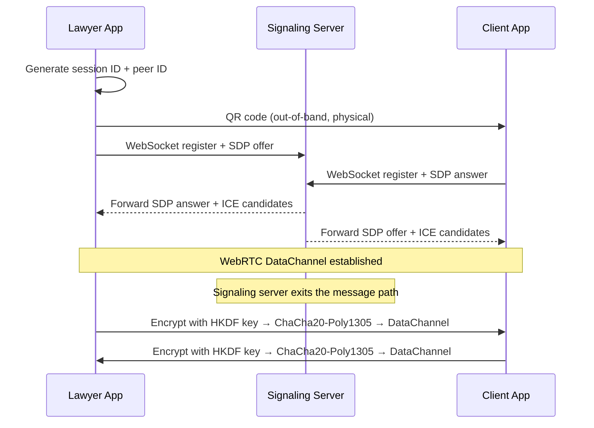

# LexLink

**E2E Encrypted Lawyer-Client Messaging**

LexLink is a mobile messaging app built for attorney-client privilege. Every message is encrypted on-device before transmission and decrypted only on the recipient's device. The server never sees plaintext.

---

## What Makes It Interesting

* **Zero-knowledge transport** — the signaling server only brokers WebRTC handshakes (SDP offers/answers and ICE candidates). After the peer-to-peer DataChannel opens, the server is completely out of the message path.
* **ChaCha20-Poly1305 AEAD** — authenticated encryption with associated data; provides both confidentiality and integrity per message.
* **HKDF-SHA-256 key derivation** — session keys are derived with asymmetric context strings (`LexLink:SEND:v1` / `LexLink:RECV:v1`), so each direction of a conversation uses a distinct key.
* **QR code out-of-band pairing** — session ID and peer ID are exchanged physically, never over the network, eliminating a whole class of MITM attacks on session setup.
* **SQLite outbox queue** — messages persist locally and are delivered once the DataChannel is ready, so the UX is never blocked by transient connectivity.

---

## System Architecture

```
┌─────────────────────────────────────────────────────────────────┐
│                        Pairing Phase                            │
│                                                                 │
│   Lawyer App          QR Code (physical)         Client App    │
│   generates  ────────────────────────────────>   scans         │
│   session ID + peer ID                           QR code       │
└─────────────────────────────────────────────────────────────────┘

┌─────────────────────────────────────────────────────────────────┐
│                     Signaling Phase                             │
│                                                                 │
│   Lawyer App ──── SDP offer ────> Signaling Server             │
│                                        │                        │
│   Client App <─── SDP answer ──────────┘                       │
│                                                                 │
│   ICE candidates exchanged both directions                      │
│   (server sees SDP/ICE only, never message content)            │
└─────────────────────────────────────────────────────────────────┘

┌─────────────────────────────────────────────────────────────────┐
│                    Messaging Phase (P2P)                        │
│                                                                 │
│   Lawyer App ◄──────────────────────────────► Client App       │
│              WebRTC DataChannel                                 │
│              ChaCha20-Poly1305 encrypted                        │
│              (server no longer involved)                        │
└─────────────────────────────────────────────────────────────────┘
```

### Sequence Diagram



---

## Tech Stack

| Layer | Choice | Why |
|---|---|---|
| Mobile app | Flutter (Dart) | Single codebase for iOS + Android |
| Transport | WebRTC DataChannel | True P2P; no relay server in message path |
| Encryption | ChaCha20-Poly1305 | AEAD cipher; fast on mobile; used by TLS 1.3 |
| Key derivation | HKDF-SHA-256 | Per-session directional keys |
| Signaling | Node.js + ws | Minimal relay; forwards SDP/ICE only |
| Local storage | SQLite (sqflite) | Persistent message history + outbox queue |
| State management | Provider pattern | Lightweight; fits Flutter's widget tree |
| Crash reporting | Sentry (`sendDefaultPii = false`) | Observability without leaking PII |

---

## Project Structure

```
firstDraft/
├── flutter_app/          # Flutter mobile app (iOS + Android)
│   └── lib/
│       ├── core/
│       │   ├── p2p/      # WebRTC service + signaling client
│       │   ├── security/ # EncryptionService (HKDF + ChaCha20)
│       │   └── service/  # ConnectionManagerService, logging
│       ├── features/
│       │   ├── contacts/ # Contact model + key storage
│       │   ├── messaging/ # Message model + SQLite persistence
│       │   ├── p2p/      # P2PMessageService + QRConnectionService
│       │   └── session/  # Session lifecycle + key management
│       └── ui/
│           ├── screens/  # Role selection, QR pairing, chat
│           └── widgets/  # QR display, QR scanner
└── signaling_server/     # Node.js WebSocket relay
    ├── server.js
    └── nginx.conf
```

---

## Quick Start

### Signaling Server

```bash
cd signaling_server
npm install
node server.js          # runs on port 8080
```

### Flutter App

```bash
cd flutter_app
flutter pub get
flutter run
```

Requires Flutter 3.x and Dart SDK 3.0+. Update `flutter_app/lib/core/p2p/signaling/signaling_config.dart` with your server's IP or hostname before running.

---

## Security Model

* Messages are encrypted before leaving the device and decrypted only on arrival. The signaling server and any network intermediary see only ciphertext.
* Session keys are derived fresh per-session via HKDF. Compromising one session does not compromise past or future sessions.
* Pairing is authenticated out-of-band via QR code. An attacker who controls the signaling server cannot inject a fake peer into an established session.
* The signaling server performs no authentication by design; session security comes entirely from the QR pairing exchange.
* Local message history is stored in SQLite on-device. No messages are stored server-side.
